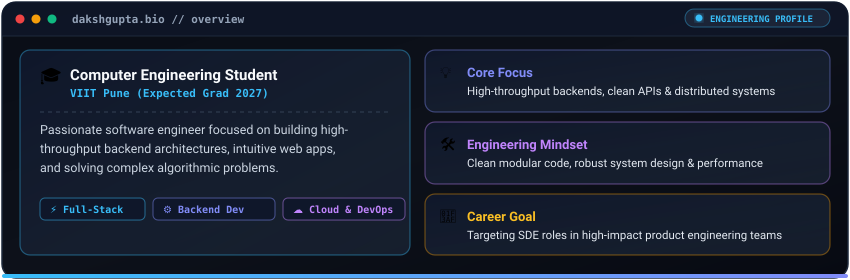
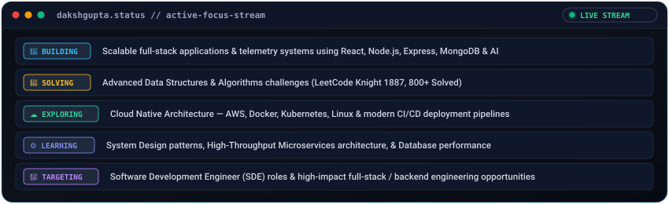
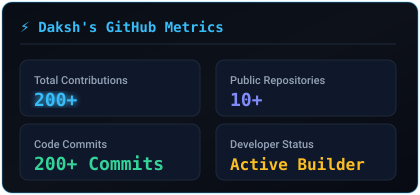
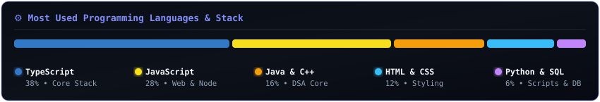
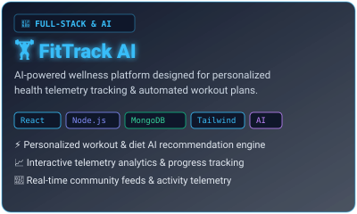
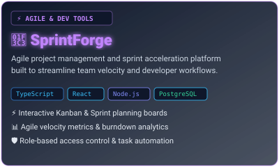
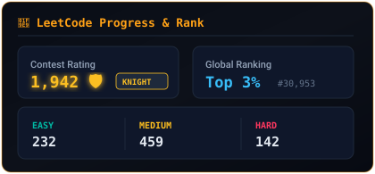
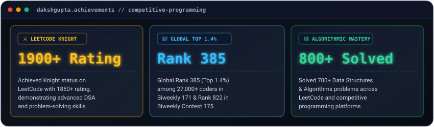

  <!-- Custom Animated Header Banner -->
  

   
   

  <!-- Animated Typing Title -->
  

  

    <strong>Building scalable software systems, high-performance backends, and elegant user experiences.</strong>
  

  <!-- Social Badges -->
  

    
    
    
    
    
  

## 👨‍💻 About Me

<!-- Modern Glassmorphic Bento Grid About Card -->

 
 

<!-- Animated Interactive Terminal Console -->

---

## 🚀 Currently

---

## 💻 Tech Stack

### Languages

### Frontend

### Backend & Databases

### Cloud, DevOps & Tools

 

<!-- Unified Skill Icons Matrix -->

---

## 📊 GitHub Analytics

  <table border="0">
    <tr>
      <td>
        
      </td>
      <td>
        
      </td>
    </tr>
    <tr>
      <td colspan="2" align="center">
        
      </td>
    </tr>
  </table>

---

## 📈 Contribution Activity

  
  

    <em>"Consistency compounds."</em>
  

---

## 🚀 Featured Projects

<table border="0">
  <tr>
    <td width="50%" align="center" valign="top">
      
       
       
      
      &nbsp;&nbsp;
      
    </td>
    <td width="50%" align="center" valign="top">
      
       
       
      
      &nbsp;&nbsp;
      
    </td>
  </tr>
</table>

---

## 🧠 Problem Solving

  <table border="0">
    <tr>
      <td align="center" width="50%" valign="middle">
        
      </td>
      <td align="center" width="50%" valign="middle">
        
      </td>
    </tr>
  </table>

  

    <strong>Focus Topics:</strong> Array • String • Hash Table • Dynamic Programming • Trees • Graphs • Two Pointers • Binary Search
  

---

## 🏆 Achievements

 

* ⚔️ **LeetCode Knight (1850+ Rating):** Demonstrated top-tier problem-solving skills and proficiency in Data Structures & Algorithms.
* 🎯 **Global Rank 385 (Top 1.4%):** Secured Rank 385 among 27,000+ worldwide participants in LeetCode Biweekly Contest 171 & Global Rank 822 in Biweekly Contest 175.
* 🧩 **700+ Algorithmic Problems Solved:** Solved 800+ Data Structures & Algorithms problems across LeetCode and competitive programming platforms.

---

## 🎓 Education

### **Vishwakarma Institute of Information Technology (VIIT)**
📍 *Pune, Maharashtra, India*  
🎓 **Bachelor of Technology (B.Tech) — Computer Engineering**  
🗓️ *Expected Graduation: 2027*

* **Key Coursework:** Data Structures & Algorithms, Object-Oriented Programming, Operating Systems, Database Management Systems, Computer Networks, Software Engineering.

---

## ⚡ Engineering Philosophy

> **Build simple systems.**  
> Complexity is the enemy of reliability. Design straightforward abstractions.

> **Solve real problems.**  
> Focus on impact, performance, user experience, and practical solutions.

> **Keep learning and shipping.**  
> Continuous iteration, consistency, and curiosity drive engineering growth.

---

## 🤝 Let's Connect

If you are interested in discussing **software engineering**, **backend architecture**, **full-stack opportunities**, **open source**, or exciting technical projects, feel free to reach out!

   
  

    
    
    
    
  

   

  Designed with ❤️ &amp; precision by Daksh Gupta • Software Engineer

